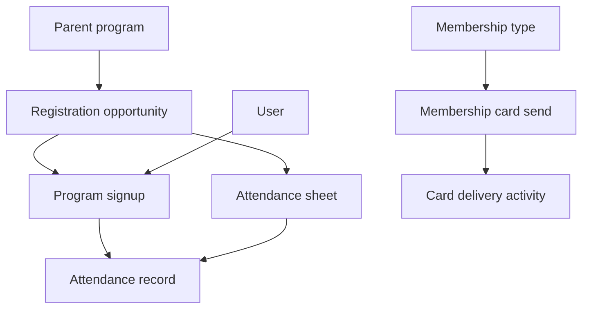

# Core concepts

Communal models recreation and membership around **programs**, **registrations**, **people**, and **attendance**. The API uses a few names that differ slightly from everyday language; this page aligns vocabulary with the paths you will see in the API Reference.

## Parent program vs registration opportunity

- **Parent program** (`/parent_programs`) is the durable offering: the thing you configure in Communal that can have many dated sessions or instances. List and show operations live under the **Program** tag in the reference.
- **Registration opportunity** (`/programs`, `/programs/{program}`) is a concrete instance people can register for — often a session with its own schedule, pricing, and capacity. The OpenAPI tag is **Registration Opportunity**. In schemas you will also see the field `registration_opportunity_id` on resources such as attendance sheets.

Use `?include=programs` on parent program endpoints when you need child registration opportunities in the same response.

## Program signup

A **program signup** connects a person (or guest flow) to a registration opportunity. Use `/program_signups` to list or filter signups and `/program_signups/{program_signup}` to load one record. Signups are the anchor for many workflows: who is registered, for which session, and with which related user or guest data when you use `include`.

## Membership type and membership card

- **Membership types** (`/membership_types`, archive actions) describe sellable membership products and their configuration.
- **Membership cards** — the **Membership Card** endpoint sends a digital card for a user by email and can create or update user data used on the card. Delivery attempts surface under **Activity** (card delivery activities).

## Attendance

- An **attendance sheet** belongs to a registration opportunity and a date (`AttendanceSheetResource.registration_opportunity_id`, `date`).
- **Attendance records** link a sheet to a **program signup** and carry a **status** (for example present/absent) and optional **notes**.

Typical flow: locate or create the relevant sheet for a session and date, then read or write **attendance records** for each signup you track.

## Activities

**Activity** endpoints expose operational events — today, **digital membership card deliveries** — with filters such as member, date range, and delivery status. Use them for auditing and support, not as the primary registration API.

## Users

The **User** endpoints let you update a user record your integration is allowed to change. Path parameters identify the user; see the reference for the writable fields on `UpdateUserRequest`.

## How the pieces connect

For request mechanics (pagination, filters, related data), see [Using the API](./using-the-api.md).
