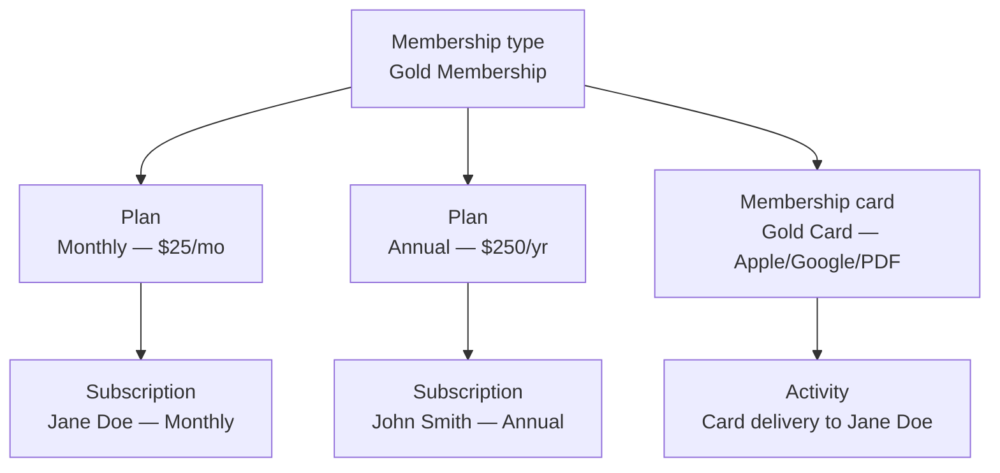

# Membership

Membership types, plans, subscriptions, and membership cards form the membership domain in Communal. This page explains what each resource represents, how they relate, and the key concepts you will encounter when building on them.

## Membership types

A **membership type** (path `/membership_types`) is the sellable membership product your organization offers — "Gold Membership," "Family Pass," or "Student Annual." It carries configuration such as title, description, associated waivers, and an optional signup form. Membership types are either **base** memberships (standalone) or **add-ons** (require the member to hold a base membership first).

Membership types are long-lived catalog items. When you archive one it becomes inactive and hidden from new purchases, but existing subscribers keep their access until their subscription expires.

## Plans

A **plan** is a pricing tier within a membership type. A single membership type can offer multiple plans — for example a monthly plan at $25/month and an annual plan at $250/year. Each plan has its own:

- **Amount** — the price charged per billing cycle
- **Interval** — the billing frequency (monthly, yearly, etc.)
- **Pricing type** — `fixed` (set price), `user_specifies` (pay-what-you-want), or `lifetime` (one-time purchase, no renewal)
- **Status** — whether the plan is active and purchasable
- **Max beneficiaries** — how many additional family members the plan covers (null means unlimited)

Plans are embedded within membership type responses — you don't query them separately.

## Subscriptions

A **subscription** represents a specific member's active membership. When someone purchases a plan, Communal creates a subscription that tracks their billing state, expiration date, and renewal preferences. Subscriptions are managed through the Stripe integration and are not directly exposed as an API resource you query — they surface through user and membership type relationships.

Key subscription states are **active** (the member has access), **expiring** (approaching `ends_at` and eligible for renewal), and **expired** (past the expiration date).

## Membership cards

A **membership card** is a digital card delivered to members via email. Cards can be generated for Apple Wallet, Google Wallet, or as a PDF. The card's visual layout is configured through a template with overlay fields (text, QR codes) positioned on a background image.

The API exposes a single card delivery endpoint (path `/membership_cards/send`) rather than full CRUD on card templates. You send a card by providing user identification and optional profile data; Communal generates the card from the configured template and delivers it. Delivery attempts are tracked as activities — see the [Track card deliveries](./track-card-deliveries.md) guide.

## How the pieces connect

The membership domain flows from catalog configuration to member access to card delivery:

Key relationships when querying the API:

- **Membership type → plans** — plans are always included in membership type responses as a nested `plans` array
- **Membership type → add-ons** — add-on types reference their base membership through `visibility_requires_base_membership`
- **Membership card → membership types** — a card template is linked to specific membership types it applies to
- **Card delivery → activities** — delivery attempts surface through the Activities endpoints with card-specific filters

## Key concepts

### Base vs add-on memberships

Membership types have a `type` of either `base` or `addon`. Base memberships are standalone — anyone can purchase them. Add-on memberships require the buyer to already hold a specific base membership. The `visibility_requires_base_membership` field controls whether an add-on is even visible to non-members in your storefront.

### Renewal types

Memberships use one of two renewal approaches. **Rolling** memberships renew indefinitely on a recurring billing cycle — the member stays active as long as payment succeeds. **Date-based** memberships expire on a fixed end date regardless of when the member purchased, which is common for seasonal or annual memberships tied to a calendar year.

### Pricing types

Plans support three pricing models: **fixed** (a set price the member pays), **user-specifies** (pay-what-you-want, useful for donations or sliding-scale memberships), and **lifetime** (a one-time purchase with no recurring billing).

### Card delivery

When you call the card send endpoint, Communal looks up or creates the user, generates cards in the requested formats (Apple Wallet, Google Wallet, PDF — all three by default), and emails them. The response includes a `request_hash` for tracing, and the delivery attempt is logged as an activity you can query later for audit or support workflows.

### Archiving

Archiving a membership type sets its status to inactive and hides it from new purchases. Existing subscriptions remain active — archiving does not cancel current members. Unarchiving restores the type to active status. Use `POST /membership_types/{id}/archive` to toggle.

## API naming

| Concept | API path | OpenAPI tag |
|---------|----------|-------------|
| Membership type | `/membership_types` | **Membership Type** |
| Membership card (send) | `/membership_cards/send` | **Membership Card** |

Plans are nested within membership type responses and do not have their own endpoint.

## What's next

- [Browse membership types](./browse-membership-types.md) — list membership types, view plans, and check availability
- [Send membership cards](./send-membership-cards.md) — deliver digital cards to members via email
- See the **Membership Type** and **Membership Card** endpoints in the API Reference for the complete field list
