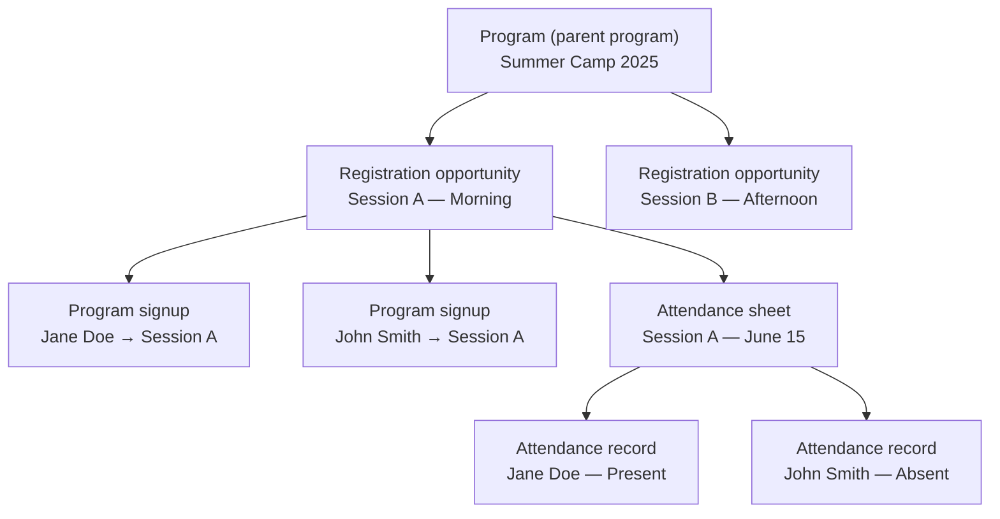

# Programs & registration

Programs, registration opportunities, signups, and attendance form the registration domain in Communal. This page explains what each resource represents, how they relate, and the key concepts you will encounter when building on them.

## Programs

A **program** (called a **parent program** in the API, path `/parent_programs`) is the durable offering your organization manages in Communal — a camp, class, league, event, or recurring activity. It carries top-level configuration such as title, location, instructor, and overall capacity. Programs are long-lived: they persist across seasons and can be reused year after year.

Programs do not hold registration directly. Instead, each program groups one or more **registration opportunities** that people actually sign up for.

## Registration opportunities

A **registration opportunity** (path `/programs`) is a concrete, registerable instance under a program. Think of it as a specific session, section, or time slot — "Session A — Morning" or "Week 3 of Summer Camp." Each registration opportunity has its own:

- **Schedule** — start and end dates and times
- **Capacity** — how many people can register
- **Pricing** — one or more pricing tiers
- **Registration window** — when registration opens and closes
- **Status** — whether the session is active, upcoming, past, or archived

## Program signups

A **program signup** (path `/program_signups`) connects a participant to a registration opportunity. It is the record that says "this person is registered for this session." Signups are the anchor for many downstream workflows — rosters, member portals, reporting, and attendance tracking.

Each signup belongs to exactly one registration opportunity and one user. Signups can also carry related data like form submissions, guest information, additional members, and payment details through includes.

Signups support time-based scopes (`upcoming`, `ongoing`, `past`) and soft-delete behavior (`withTrashed`) so you can build views that show current rosters, historical participation, or both.

## Attendance

Attendance is tracked through two resources that work together:

- **Attendance sheet** (path `/attendance_sheets`) — belongs to a registration opportunity and a specific date. Think of it as one page in an attendance book: "Session A — Morning, June 15."
- **Attendance record** (path `/attendance_records`) — links an attendance sheet to a program signup and carries a status (present, absent, etc.) and optional notes.

The typical flow is: find or create the attendance sheet for a session and date, then read or write attendance records for each signup on that sheet.

## How the pieces connect

The registration domain follows a clear hierarchy: programs group registration opportunities, signups connect people to those opportunities, and attendance sheets track who showed up on each date.

Key relationships when querying the API:

- **Program → registration opportunities** — use `include=programs` on a parent program, or filter registration opportunities by `parent_program_id`
- **Registration opportunity → signups** — filter signups with `filter[program_id]`, or use `include=signups` on a registration opportunity
- **Registration opportunity → attendance sheets** — filter sheets with `filter[registration_opportunity_id]`, or use `include=attendanceSheets`
- **Attendance sheet → records** — filter records with `filter[attendance_sheet_id]`, or use `include=records` on a sheet
- **Signup → attendance records** — use `include=attendanceRecords` on a signup to see all attendance for that registration

## Key concepts

### Capacity

Capacity controls how many people can register for a session.

- **Total spots** — the overall limit for a program, aggregated across its registration opportunities.
- **Class limit** — the per-session cap on a single registration opportunity.
- **Spots remaining** — how many seats are still open.
- **Uncapped** — when no limit is set, a session accepts unlimited registrations.

The API surfaces fields like `total_spots`, `available_spots`, `class_limit`, `spots_remaining`, and `is_full` so you can display availability without computing it yourself.

### Waitlists

When a session is full and the organization has enabled waitlisting, new signups are placed on a waitlist. The `waitlist_enabled` flag tells you whether to show a "Join waitlist" option, and the `waitlistSignups` include returns the current waitlist entries.

### Pricing tiers

Registration opportunities can have multiple pricing tiers — for example an early-bird rate, a standard rate, and a membership discount. Use `include=prices` on a registration opportunity to load them. Deeper includes like `prices.membership` and `prices.plan` reveal which tiers are tied to specific membership types or payment plans.

### Registration windows

Each session defines when registration opens and closes via `registration_start_date` and `registration_end_date`. The `can_register` filter returns only sessions currently accepting signups, so you can build a catalog that automatically hides sessions before or after their registration window.

### Status lifecycle

Programs and registration opportunities move through statuses over their lifetime:

- **Active** — currently visible and available
- **Upcoming** — registration has not yet opened
- **Ongoing** — the event is in progress
- **Past** — the event has ended
- **Archived** — removed from active listings

Use `filter[status]` to retrieve sessions in a specific phase, or convenience filters like `filter[upcoming]` and `filter[past]`.

## API naming

The API uses different path names than you might expect:

| Concept | API path | OpenAPI tag |
|---------|----------|-------------|
| Program | `/parent_programs` | **Program** |
| Registration opportunity | `/programs` | **Registration Opportunity** |
| Program signup | `/program_signups` | **Program Signup** |
| Attendance sheet | `/attendance_sheets` | **Attendance Sheet** |
| Attendance record | `/attendance_records` | **Attendance Record** |

The `/programs` path for registration opportunities exists for historical reasons. The guides and this documentation use the conceptual names; the API Reference uses the path-based names.

## What's next

- [Fetch program information](./fetch-program-information.md) — list programs, filter results, and include registration opportunities
- [Browse registration opportunities](./browse-registration-opportunities.md) — find available sessions, check capacity, and load pricing
- [Retrieve program signups](./retrieve-program-signups.md) — list and filter signups for a session
- [View attendance](./view-attendance.md) — load attendance sheets and records for sessions
