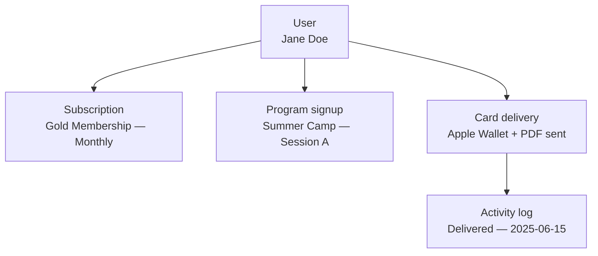

# Users & activity

Users and activities form the people and audit layer in Communal. This page explains what each resource represents, how they relate, and the key concepts you will encounter when building on them.

## Users

A **user** (path `/users`) represents a person in your Communal organization — a member, participant, or staff. The user record holds identity and contact information: name, email, address, phone number, and custom profile fields. Users are the people who hold memberships, register for programs, and receive membership cards.

The public API exposes a single update endpoint for users. You cannot list or create users through the API directly — users are created through the Communal platform, through the membership card send flow (which creates a user if the identifier doesn't match an existing one), or through program registration.

Key attributes on a user:

- **Name fields** — `first_name`, `last_name`, `middle_name`, `preferred_name`
- **Contact** — `email`, `telephone`
- **Address** — `profile_address`, `profile_city`, `profile_state`, `profile_zip`, `profile_country`
- **Custom data** — `custom_form` for organization-specific profile fields

## Activities

An **activity** (path `/activities/card-deliveries`) is an operational log entry tracking events in the system. The current API surface focuses on **digital membership card deliveries** — each time a card is sent to a member, Communal logs an activity with delivery details.

Each card delivery activity records:

- **Delivery status** — `success` or `failed`
- **Card formats** — which formats were generated (Apple Wallet, Google Wallet, PDF)
- **Recipient details** — the user, their member ID, and the email addresses attempted
- **Traceability** — a `request_hash` linking the activity back to the originating API call
- **Failure details** — reason and error message when delivery fails

Activities are read-only. You query them for auditing, support, and monitoring — not for triggering actions.

## How the pieces connect

Users sit at the center of the platform. They hold memberships, register for programs, and receive cards. Activities provide an audit trail of card deliveries.

Key relationships when querying the API:

- **User → memberships** — users hold subscriptions to membership types (visible through membership type includes, not the user endpoint directly)
- **User → program signups** — filter signups with `filter[user_id]` on the program signups endpoint
- **Card delivery → activity** — after sending a card via `/membership_cards/send`, query `/activities/card-deliveries` with `filter[request_hash]` to trace the delivery

## Key concepts

### Profile sync

The user update endpoint is designed for **profile sync** — pushing corrected or enriched data from an external system (CRM, membership database, school information system) into Communal. Required fields are `first_name`, `last_name`, and `email`. All other fields are optional and nullable.

### Custom form data

Users can have organization-specific profile fields captured through `custom_form`. This is an object with an `id` (the form template) and a `data` array of field values. Use this to store and update custom data that doesn't fit the standard profile fields.

### Manager vs member access

API access to user data follows a manager/member permission model. Manager API keys can update any user and access sensitive fields like address and phone number. Non-manager keys are restricted to the authenticated user's own record.

### Card delivery tracing

Every card send request generates a `request_hash` in the response. Use this hash to query the activities endpoint and trace the delivery — check whether it succeeded, which email addresses were attempted, and what card formats were generated. This is essential for building support workflows around failed deliveries.

## API naming

| Concept | API path | OpenAPI tag |
|---------|----------|-------------|
| User | `/users` | **User** |
| Card delivery activity | `/activities/card-deliveries` | **Activity** |

## What's next

- [Update user profiles](./update-user-profiles.md) — sync user data from external systems
- [Track card deliveries](./track-card-deliveries.md) — monitor and audit membership card delivery attempts
