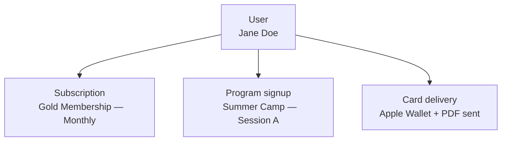

# Users

A **user** (path `/users`) represents a person in your Communal organization — a member, participant, or staff. The user record holds identity and contact information: name, email, address, phone number, and custom profile fields. Users are the people who hold memberships, register for programs, and receive membership cards.

The public API exposes a single update endpoint for users. You cannot list or create users through the API directly — users are created through the Communal platform.

Key attributes on a user:

- **Name fields** — `first_name`, `last_name`, `middle_name`, `preferred_name`
- **Contact** — `email`, `telephone`
- **Address** — `profile_address`, `profile_city`, `profile_state`, `profile_zip`, `profile_country`
- **Custom data** — organization-specific custom profile fields, exposed through dedicated read endpoints

## How the pieces connect

Users sit at the center of the platform. They hold memberships, register for programs, and receive cards.

Key relationships when querying the API:

- **User → memberships** — users hold subscriptions to membership types (visible through membership type includes, not the user endpoint directly)
- **User → program signups** — filter signups with `filter[user_id]` on the program signups endpoint

## Key concepts

### Profile sync

The user update endpoint is designed for **profile sync** — pushing corrected or enriched data from an external system (CRM, membership database, school information system) into Communal. Required fields are `first_name`, `last_name`, and `email`. All other fields are optional and nullable.

### Custom profile fields

Organizations can define custom profile fields beyond the standard identity, contact, and address fields. The API exposes these through two read-only endpoints: `custom_profile_fields` for the field definitions and `custom_profile_field_values` for the stored values, filterable by user. See [Read custom profile fields](./custom-profile-fields.md) for details.

### Manager vs member access

API access to user data follows a manager/member permission model. Manager API keys can update any user and access sensitive fields like address and phone number. Non-manager keys are restricted to the authenticated user's own record.

## API naming

| Concept | API path | OpenAPI tag |
|---------|----------|-------------|
| User | `/users` | **User** |
| Custom profile field | `/custom_profile_fields` | **Custom Profile Field** |
| Custom profile field value | `/custom_profile_field_values` | **Custom Profile Field Value** |

## What's next

- [Update user profiles](./update-user-profiles.md) — sync user data from external systems
- [Read custom profile fields](./custom-profile-fields.md) — list custom field definitions and a user's stored values
